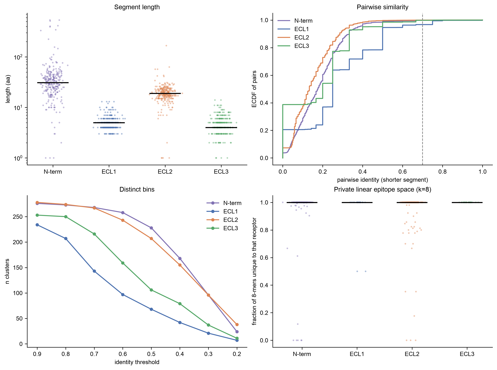
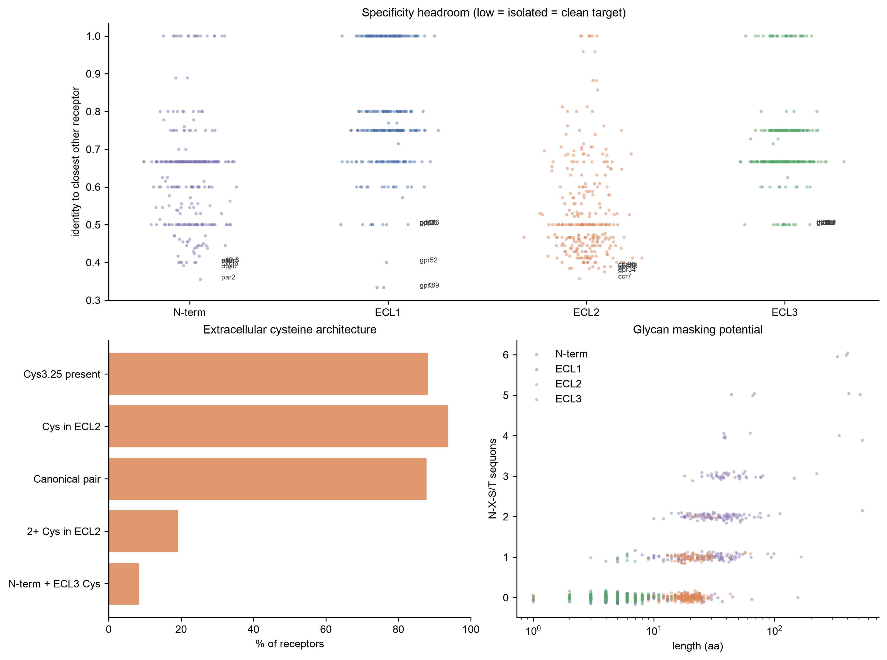
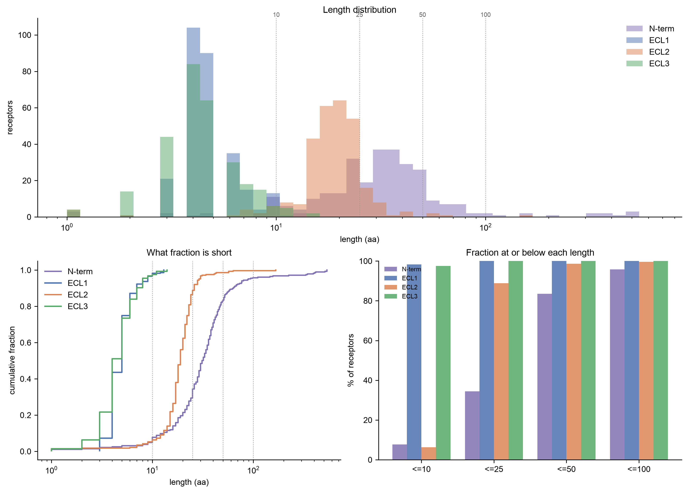
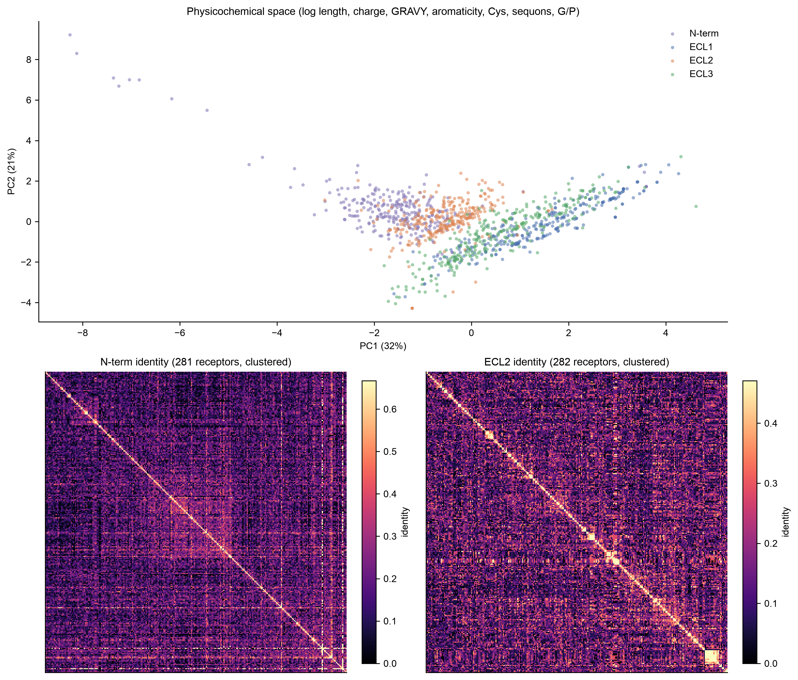
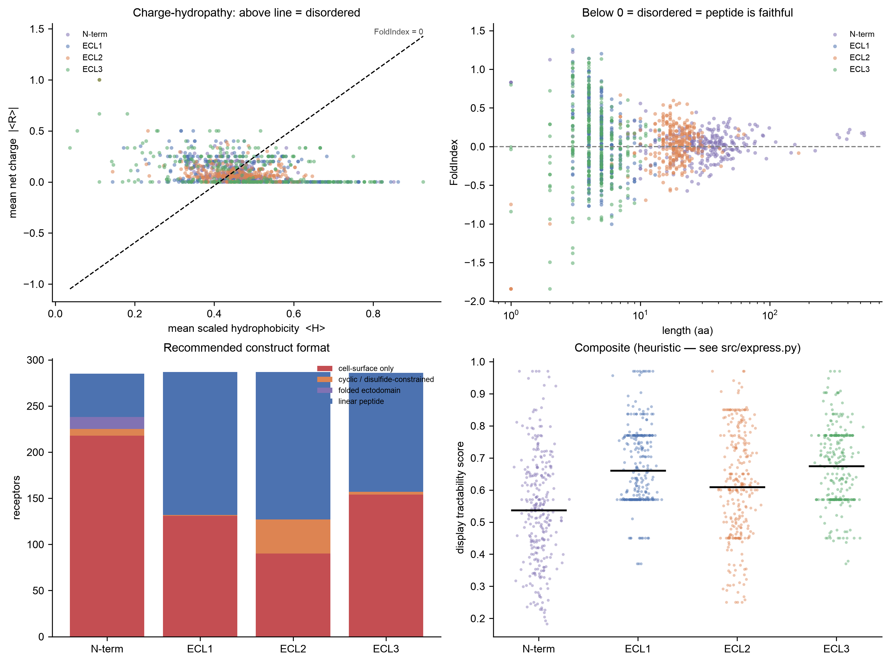

# Class A GPCR extracellular loops — antigenic space

How much genuinely distinct surface is there across the N-terminus and
ECL1/2/3 of the whole Class A repertoire (orphans included), and where does an
antibody have room to be specific.

Code and figures are checked in. `data/` and `results/` are gitignored and
regenerate from scratch with `python run_all.py`.

## Setup

```bash
conda env create -f environment.yml
conda activate gpcr-ecl
```

Or without conda:

```bash
python -m venv .venv && source .venv/bin/activate
pip install -r requirements.txt
```

## Run

```bash
python -m tests.smoke_test
rm -rf data results figures
python run_all.py
```

Run the smoke test first. It builds 60 synthetic receptors offline and
exercises every downstream module in well under a minute. If it passes and the
real run fails, the problem is the network or the GPCRdb API, not the code.
Clear `data results figures` afterwards so the synthetic run does not get
mistaken for real output.

`run_all.py` steps: fetch → loops → express → similarity → notebooks → report.
Everything caches to `data/cache/`, so an interrupted run resumes cheaply and
`python run_all.py --skip-fetch` re-runs the analysis without re-downloading.
Each step also runs standalone (`python -m src.loops`, etc.).

Expect a couple of minutes for the fetch (~300 receptors × 2 API calls) and
roughly 10–25 min on 8 cores for the pairwise alignments, which dominate.

Needs network access to `gpcrdb.org` and `rest.uniprot.org`. Nothing else is
remote. UniProt is queried in batches of 100 accessions against the stream
endpoint (3 requests, not 300) — per-accession fan-out gets you rate-limited
off the service.

Orphan status: GPCRdb does not label every deorphanisation-pending receptor
with "orphan" in its family name, so the flag falls back on the GPR-naming
convention. `data/family_tree.csv` lists the family names actually returned —
worth a look if the orphan count seems off.

Then:

```bash
open figures/*.png
less results/REPORT.md
python -m src.query drd2_human
```

## Layout

```
run_all.py                 driver
src/config.py              every knob
src/fetch.py               GPCRdb residue segments + UniProt annotations
src/loops.py               segment sequences, signal-peptide trim, disulfide audit
src/express.py             phage-display tractability heuristic
src/similarity.py          pairwise identity, k-mers, clustering
src/report.py              results/REPORT.md
src/query.py               per-target lookup
src/style.py               Arial + palette, imported by the notebooks
notebooks/0*.ipynb         one standalone notebook per figure
tools/build_notebooks.py   regenerates the notebook set; overwrites, use with care
tests/smoke_test.py        offline end-to-end check
```

Figures live in the notebooks, one per figure, each self-contained — imports
what it needs, reads the CSVs, draws, saves. Edit them directly. `run_all.py`
executes them headlessly via nbconvert and does **not** write outputs back into
the `.ipynb`, so the diffs stay clean.

## Why not a multiple sequence alignment

A whole-family MSA of full-length Class A receptors is fine in the TM bundle
and near-meaningless in the loops: ECL2 runs from ~10 to ~180 residues with no
shared framework, so any aligner piles up gap columns and produces "homology"
that is really alignment artefact. Column-wise conservation off that is not
interpretable.

Instead: **structure-anchored segment assignment from GPCRdb**. Their
`/services/residues/{entry}/` endpoint returns, per residue, the segment
(TM1–TM7, ICL1–3, ECL1–3, N-term, H8, C-term) and the Ballesteros–Weinstein
generic number. Those boundaries come from a profile alignment anchored on the
most conserved TM positions (1.50, 2.50, 3.50, 6.50, 7.50) and on solved
structures — the loops are defined by where the helices *end*, which is the
physically meaningful definition, rather than by loop alignment itself.

Segments are then compared **pairwise only**, never in one global MSA.
`src/fetch.py` also has a UniProt `TOPO_DOM` fallback for an independent,
prediction-based set of boundaries to check against.

## What "different antigenic space" means here

Four views, because the word means different things depending on the binder:

1. **Pairwise identity per segment**, normalised by the *shorter* one. A 9-mer
   fully contained in a 40-mer is a real cross-reactivity liability that a
   global-alignment %ID hides behind gap penalties.
2. **k-mer overlap (k=5, 8)** — linear-epitope level. Distinct 8-mers across
   the class = size of the linear epitope space; those present in exactly one
   receptor = private space. `src/query.py` reports, for one target, the
   contiguous stretches unique in all of Class A.
3. **Clustering at identity cut-offs** (average linkage on 1−identity). The
   headline number: how many mutually dissimilar bins exist at 40/60/80%.
4. **Physicochemical features** — length, net charge, GRAVY, aromaticity,
   cysteines, N-X-S/T sequons. Two segments can be unrelated in sequence and
   still both be short, acidic and glycan-covered, i.e. occupy the same
   *practical* space for a panning campaign.

`ECF` is a pseudo-segment: N-term + ECL1 + ECL2 + ECL3 concatenated, a proxy
for the assembled extracellular face. The N-term dominates it for the
glycoprotein hormone and LGR receptors, which have enormous ectodomains.

## The cysteine

The conserved residue is **Cys3.25**, at the extracellular end of TM3, forming
a disulfide with a cysteine in **ECL2** — a bond *tethering* ECL2 back to TM3
rather than a cysteine sitting between them.

It is the most conserved non-TM feature in Class A, roughly 90% of receptors,
but not universal; the exceptions cluster in the lipid receptor branch
(cannabinoid receptors are the textbook case). `src/loops.py` measures it
rather than assuming it — `results/disulfide_audit.csv` has the per-receptor
call and `REPORT.md` prints the exact percentage plus the full exception list.

Also flagged, because they matter for panning:

- **≥2 Cys in ECL2** — a second internal disulfide, an even more constrained loop.
- **Cys in both N-term and ECL3** — a bond stapling the N-term over the pocket,
  common in peptide receptors.

Consequence: ECL2 is a covalently constrained, often β-hairpin element folded
onto the pocket. Antibodies raised against linear ECL2 peptides very often fail
on the folded receptor, and binders selected on whole cells against ECL2 are
usually conformational and won't map back to a linear peptide. The k-mer
"private epitope" output is an *upper bound* on linear-epitope specificity, not
a design recipe; the identity and clustering views are what transfer to
whole-cell panning.

## The N-terminus

A first-class segment throughout, plotted everywhere the loops are. Two things
make it different from the loops, both handled:

- **Signal peptides.** UniProt numbering starts at residue 1 of the precursor,
  so the annotated N-term of many Class A receptors opens with a signal peptide
  that is cleaved and is not on the mature receptor. Displaying that on phage
  would select binders against a sequence that does not exist in vivo.
  `USE_UNIPROT_ANNOT` pulls the `Signal` feature and `TRIM_SIGNAL_PEPTIDE`
  removes it; trimmed lengths are in `receptors_wide.csv`.
- **Length range.** The loops are peptide-scale. The N-term is not — it spans
  short stubs through the LRR ectodomains of LGR4/5/6 and the glycoprotein
  hormone receptors. `03_lengths.ipynb` shows where the split falls.

## Can it be displayed on phage

`src/express.py`, a transparent triage heuristic — every sub-score written out
separately so the weighting can be argued with. Roughly in order of how much it
matters:

**Fold state.** FoldIndex (Prilusky 2005) = `2.785*<H> − |<R>| − 1.151` on the
Kyte-Doolittle scale rescaled to 0–1; negative = intrinsically disordered. The
counter-intuitive part: for peptide display, **disorder is what you want**. If
the segment is disordered in the intact receptor, a synthetic peptide of it
samples roughly the same ensemble as the native thing, so a binder raised on it
has a real shot on the cell. If it's predicted to fold, the isolated peptide
won't reproduce that fold and you'll select against a conformation that doesn't
exist in vivo. This sub-score decides whether the exercise is worth doing.

**Length.** Below ~8 aa there isn't enough surface for a paratope and you
select on flanking vector sequence. Above ~45–80 aa you aren't displaying a
peptide, you're displaying a domain that has to fold in the periplasm.

**Cysteine parity.** Odd free Cys in an oxidising periplasm scrambles. Even is
an opportunity: cyclise and recover the native constraint. Zero is easiest to
make and least native-like.

**Glycans.** Display in E. coli is aglycosylated. A segment carrying several
N-glycans is substantially covered on a real cell, so binders selected against
the bare backbone may be hitting epitopes that are physically inaccessible.
Most common reason a clean peptide-derived clone does nothing in a whole-cell
binding assay. Annotated UniProt glycosites used where available, sequons
otherwise.

**Aggregation.** Contiguous hydrophobic, low-net-charge windows drive fusion
toxicity, poor phage yield, and enrichment of amyloid-binders.

**Leucine-rich repeats.** Detected and routed to a "folded ectodomain"
recommendation rather than penalised — those are proteins, not peptides.

Output is `results/display_tractability.csv`: per segment, all sub-scores, a
composite, a recommended construct format (linear peptide / cyclic /
folded ectodomain / cell-surface only), and plain-text flags. A ranking tool for
deciding where to spend a construct, not a prediction.

### Before you use `recommended_format`

Two calibration faults make that column untrustworthy as it stands — see
"Caveats and future work" at the end. The sub-scores and flags are fine; use
`fold_index`, `s_length`, `n_cys`, `n_glyco` and `flags` directly for now.

## Outputs

```
results/REPORT.md                  numbers, written last — read this first
results/segments_long.csv          per receptor x segment: sequence, length, features
results/receptors_wide.csv         one row per receptor
results/disulfide_audit.csv        Cys3.25 / ECL2 cysteine calls
results/display_tractability.csv   sub-scores + recommended construct format
results/glycosites_annotated.csv   UniProt N-glycans per segment
results/pid_{segment}.csv.gz       full pairwise identity matrices
results/cluster_counts.csv         n clusters vs identity threshold
results/kmer_summary.csv           size of linear epitope space
results/nearest_neighbours.csv     closest off-target per receptor per segment
results/crossreactive_pairs_*.csv  pairs above the cross-reactivity threshold

figures/01_overview.png            length, similarity, clustering, private space
figures/02_targets.png             specificity headroom, cysteines, sequons
figures/03_lengths.png             length distributions, ECDF, % under cutoffs
figures/04_diversity.png           feature-space PCA + clustered identity heatmaps
figures/05_displayability.png      charge-hydropathy, FoldIndex, construct calls
```

## Figures

One standalone notebook per figure in `notebooks/`. Each is a `subplot_mosaic`
of four panels.

`figures/` is tracked in git so these render on GitHub. They are regenerated on
every run, so re-running the pipeline will show them as modified even when
nothing meaningful changed — `git checkout figures/` to discard that.

**01_overview — the headline answer.** Segment length (log), the ECDF of
pairwise identity with the 70% cross-reactivity line marked, number of distinct
clusters as the identity cut-off is relaxed, and the fraction of each
receptor's 8-mers that appear nowhere else in Class A. Read the clustering
panel for "how much space is there" and the k-mer panel for "does this receptor
have anything of its own".



**02_targets — which receptor to go after.** The large panel is identity to
each receptor's nearest neighbour per segment, with the eight most isolated
labelled: low means clean specificity headroom. Below it, the extracellular
cysteine architecture across the class (Cys3.25, ECL2 cysteines, the canonical
pair, second bonds), and sequon count against length as a glycan-masking proxy.



**03_lengths — are the loops really all short.** Overlaid log histograms, ECDFs,
and the percentage of receptors at or below 10/25/50/100 aa. The three ECLs are
peptide-scale; the N-terminus is not, and the right-hand tail is the LRR
ectodomain receptors. Lengths are post-signal-peptide-trim.



**04_diversity — how different are they really.** PCA of all four segments in
physicochemical space (log length, charge density, GRAVY, aromaticity, Cys,
sequons, G/P) — overlap means two segments are interchangeable to a campaign
even when their sequences are unrelated. Below, hierarchically clustered
identity heatmaps for N-term and ECL2: look for whether structure is a few
tight family blocks on an otherwise flat background.



**05_displayability — can it be made.** Charge–hydropathy plane with the
FoldIndex = 0 boundary drawn, FoldIndex against length, the construct-format
call per segment, and the composite score distribution. Points below the line /
below zero are disordered, which is the good case for peptide display. Treat
the format panel as provisional — see the caveats.



## Knobs

All in `src/config.py`. The ones worth touching: `INCLUDE_OLFACTORY` (off —
~400 ORs otherwise dominate every distribution), `SPECIES`, `KS`,
`ID_THRESHOLDS`, `CROSSREACT_PID`, `MIN_LOOP_LEN`, `TRIM_SIGNAL_PEPTIDE`.

## Sanity baselines

The smoke test builds receptors from random sequence. Median pairwise identity
there lands around 0.13 — that's the null. Real ECL1/ECL3 should sit clearly
above it within families and near it across families; if a real run comes back
at 0.13 across the board, something upstream broke.

## First full run — 2026-10-07

287 human Class A receptors, non-olfactory, SwissProt only. 49 s end to end on
a 16-core M-series Mac with the GPCRdb residue fetch already cached.

Segment counts entering the pairwise analysis, after the `MIN_LOOP_LEN = 3`
filter: ECL1 287, ECL2 282, N-term 281, ECL3 268, ECF 287. So 19 receptors
have an ECL3 under 3 aa and 6 have effectively no N-terminus left once the
signal peptide is trimmed. Both are plausible but unverified — filter
`results/segments_long.csv` to `length < 3` to confirm they are genuinely
stubby rather than annotation gaps.

13 N-termini called `folded ectodomain`, none elsewhere. That should be the
LGR4/5/6 and glycoprotein hormone receptor set; check `fshr_human`,
`tshr_human`, `lgr5_human` are among them.

## Troubleshooting

- **GPCRdb or UniProt 503 / timeouts** — retries with backoff are built in, and
  transient failures are never cached, so just re-run: the cache picks up where
  it stopped and only the missing calls go out again. The UniProt step is
  optional — if it can't be reached the run continues without signal-peptide
  trimming, and `--no-uniprot` skips it outright.
- **`nan` identities** — segment shorter than `MIN_LOOP_LEN`. Expected for a
  handful of very short ECL3s.
- **Alignments taking forever** — set `N_ALIGN_WORKERS` in `src/config.py`, or
  drop `ECF` and `N-term` from the `similarity.run()` segment list; those are
  the longest and cost the most.
- **Figures in DejaVu instead of Arial** — the notebooks print a warning when
  Arial doesn't resolve. Install it or edit `SANS` in `src/style.py`.

## Caveats and future work

Flagged during the build and the first full run, not yet fixed.

### Known bugs in `recommended_format`

**Glycan penalty is a cliff.** `s_glycan = clip(1 - (n_glyco/length)*25, 0, 1)`,
so for any segment under ~38 aa a **single** sequon drops it to 0 and forces
`cell-surface only` (40–60 aa needs two). That is the `*25` scale factor, not a
judgement about occlusion, and it is what puts 131/287 ECL1, 154/287 ECL3 and
218/281 N-termini in that bucket. Fix: scale by the fraction of the segment one
glycan plausibly covers, and demote glycan masking to a flag.

**Single-Cys ECL2 is called `linear peptide`.** ~90% of ECL2s carry exactly one
cysteine whose partner is Cys3.25, in TM3, outside the loop — so the isolated
peptide has an unpaired free thiol and will scramble or dimerise. The rule only
penalises odd counts *above* one, so `n_cys == 1` passes while `n_cys == 3` is
rejected, which is backwards. Most of the ~160 ECL2s called `linear peptide`
are wrong. Fix: make the TM3-tether status from `disulfide_audit.csv` a
first-class input and emit a `cys_handling` column (Cys→Ser / engineered
flanking Cys / whole-cell only).

### Unverified in the current output

- 19 receptors have an ECL3 under 3 aa and 6 have no N-terminus left after
  signal-peptide trimming. Plausible, but filter `segments_long.csv` to
  `length < 3` and confirm they are stubby rather than annotation gaps.
- 13 N-termini called `folded ectodomain` should be the LGR4/5/6 and
  glycoprotein hormone receptor set. Spot-check `fshr_human`, `tshr_human`,
  `lgr5_human`.
- Orphan status falls back on the GPR naming convention because no GPCRdb
  family is named "orphan" (`data/family_tree.csv` lists what was returned).
  Not validated against IUPHAR, which is the list to use.

### Method limits

- **Sequence identity is a poor proxy for conformational epitope similarity.**
  The biggest one. Whole-cell panning selects conformational epitopes on an
  assembled surface; everything here is linear. An ESM-2 embedding comparison
  or a structure-based one (AF2 / GPCRdb structures) is the honest next step.
- The k-mer "private epitope" output is an **upper bound** on linear-epitope
  specificity, not a design recipe — ECL2 in particular is disulfide-tethered
  and rarely behaves as a linear epitope.
- Glycosylation is scored as sites, not occupancy. No information on whether a
  sequon is actually used or what glycoform sits there.
- `ECF` is dominated by the N-terminus for receptors with large ectodomains, so
  its identity values mostly report N-term similarity for those.
- Human-only by default. A counter-screen matrix needs `SPECIES = None` plus
  mouse/cyno orthologues; the pipeline is species-agnostic.
- Aggregation and fold state are sequence heuristics, not predictions. No
  periplasmic expression data anywhere in the loop.
